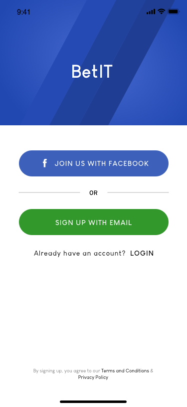
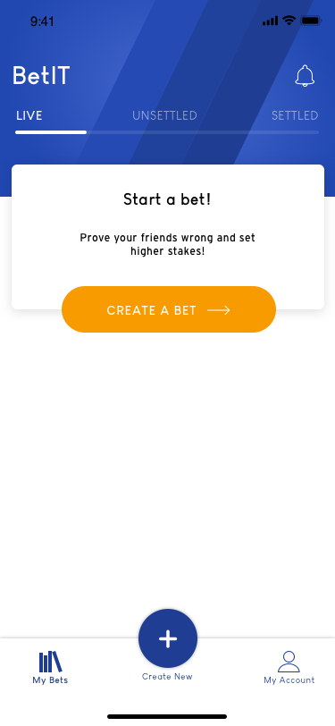
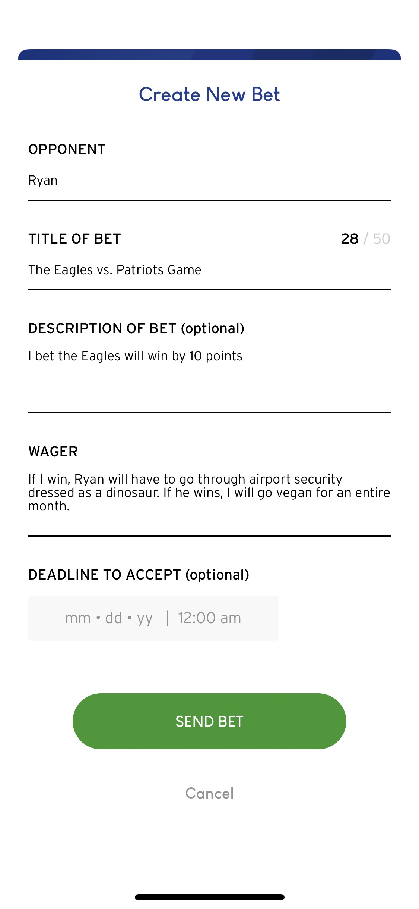
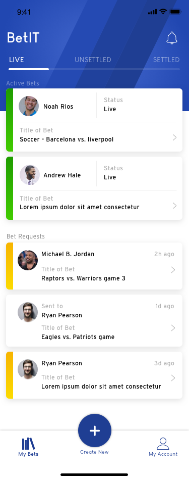
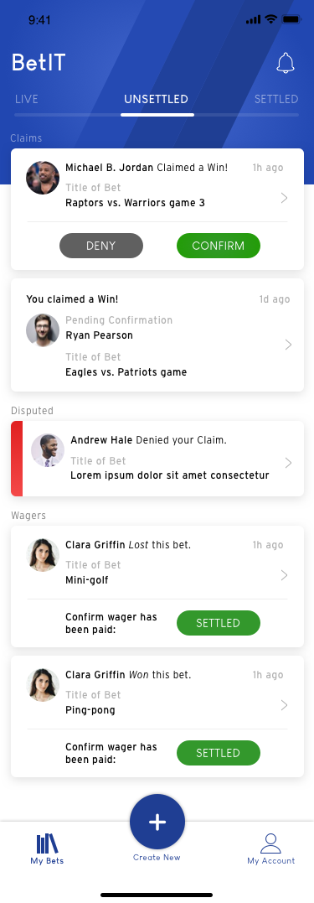
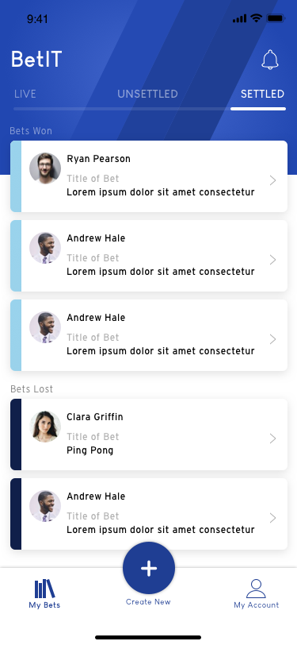
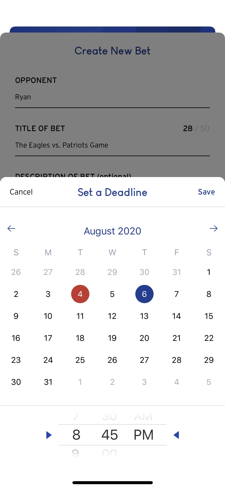
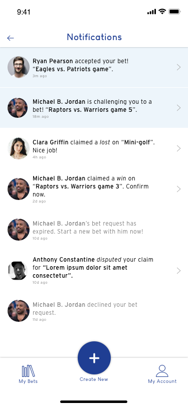
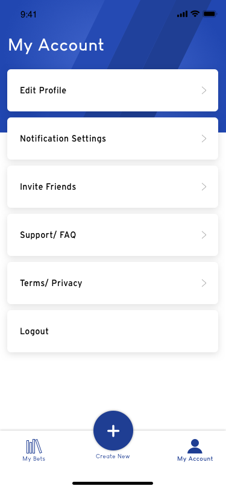
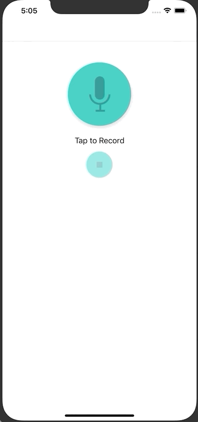

# iOS-Projects

This is a collective repository for my iOS projects. [Pitch Perfect](https://github.com/jmg764/iOS-Projects/tree/master/Pitch%20Perfect), [Virtual Tourist](https://github.com/jmg764/iOS-Projects/tree/master/Virtual%20Tourist), and [Plop](https://github.com/jmg764/iOS-Projects/tree/master/Plop) were made as part of [Udacity's iOS Developer Nanodegree](https://www.udacity.com/course/ios-developer-nanodegree--nd003).

BetIT is an iOS app that I helped develop during my internship at [Majestyk Apps](https://www.majestykapps.com), and is [now available on the App Store](https://apps.apple.com/us/app/betit/id1483328662). It allows users to create, send, and track friendly (non-monetary) wagers with others.

## BetIT

<table>
  <tr>
    <td valign="top"></td>
    <td valign="top"></td>
    <td valign="top"></td>
  </tr>
 </table>
 
 <table>
  <tr>
    <td valign="top"></td>
    <td valign="top"></td>
    <td valign="top"></td>
  </tr>
 </table>
 
 <table>
  <tr>
    <td valign="top"></td>
    <td valign="top"></td>
    <td valign="top"></td>
  </tr>
 </table>
 

## Plop

## Virtual Tourist

## Pitch Perfect

